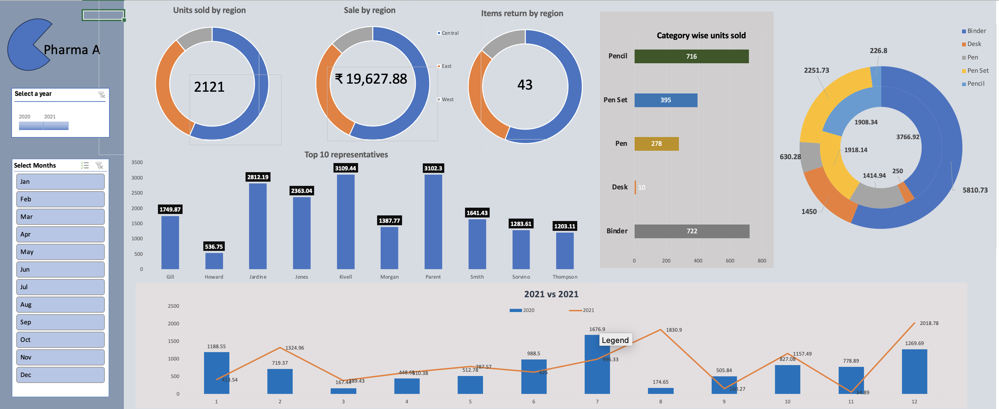

# 💊 Pharma Market Research – Excel Sales Dashboard & Competitor Analysis

This project is a comprehensive **pharmaceutical market research analysis** built using Microsoft Excel. It includes a dynamic sales dashboard, a competitor performance assessment, and a final PowerPoint presentation summarizing key findings.

---

## 🧩 Project Scope

The objective of this project was to simulate a real-world market research task, analyzing dummy sales data and competitor performance to answer:

- ✅ Who are the main competitors in the market?
- ✅ What are their key strengths and weaknesses?
- ✅ How do their sales figures compare to ours?
- ✅ What strategic opportunities can be derived from this analysis?

---

## 📁 Files Included

| File | Description |
|------|-------------|
| `Market_Research_Sales_Excel_Exercise.xlsx` | Contains raw sales data, pivot analysis, and an interactive dashboard |
| `Competitor_Assessment.xlsx` | Features competitor comparison charts and evaluation |
| `presentation excel task2.pptx` | Final presentation outlining insights, conclusions, and recommendations |
| `dashboard_preview.png` | A preview image of the Excel sales dashboard |

---

## 📊 Tools & Features Used

- Microsoft Excel:
  - Pivot Tables
  - Slicers & Filters
  - Bar & Line Charts
  - Competitor SWOT-style visualizations
  - Conditional formatting
  - Data cleaning & summarization

---

## 🔍 Key Highlights

- Region-wise and Product-wise sales breakdown
- Interactive dashboards to filter by category, region, or competitor
- Competitor strength/weakness analysis visualized in Excel
- Business presentation mimicking a real consulting output

---

## 📌 How to Use

1. Open the `Market_Research_Sales_Excel_Exercise.xlsx` file to interact with the dashboard.
2. Explore `Competitor_Assessment.xlsx` for visual competitor performance.
3. View `Pharma_Market_Insights_Presentation.pptx` for a clean summary of findings.

---

## 👩‍💻 About Me

Hi! I’m **Mehreen Malik**, a Data Analyst with a background in business intelligence and data analytics. I love transforming data into actionable stories using tools like Excel, SQL, and Power BI.

🔗 [LinkedIn](https://www.linkedin.com/in/malikmehreen)

---

## 📬 Feedback & Collaboration

If you have suggestions or ideas, feel free to reach out or connect with me on LinkedIn!

